# Notes on Splunk Enterprise Security (ES) — what this POC has and doesn't

This POC runs **Splunk Enterprise** (the indexing/search/alerting platform) but
**not Splunk Enterprise Security (ES)** (the licensed SIEM application that runs
on top of it). ES requires a separate paid license and was deliberately
excluded to keep the POC cost-controlled.

Here's a precise accounting of what that means, so the demo story doesn't
oversell or undersell what's been built.

## How it's deployed

```mermaid
flowchart TB
    subgraph external["External"]
        Browser([Browser<br/>anywhere])
        IdP[SSO Identity Provider<br/>Google / GitHub / etc.]
        GHA[GitHub Actions<br/>TotallyWildAi/splunk-detection-poc]
        DataSources["AWS Data Sources<br/>CloudTrail · VPC Flow Logs<br/>GuardDuty · CloudWatch"]
    end

    subgraph cfedge["Cloudflare edge"]
        CFAccess["Cloudflare Access<br/>SSO policy: cintelis.ai allowed"]
        CFTunnel["Cloudflare Tunnel<br/>splunk-poc.totallywild.ai<br/>splunk-poc-hec.totallywild.ai"]
    end

    subgraph aws["AWS account 637675605233 · ap-southeast-2"]
        subgraph vpc["VPC 10.2.0.0/16"]
            subgraph pub["Public subnet 10.2.0.0/24"]
                IGW[Internet Gateway]
                NAT["NAT Gateway<br/>EIP"]
            end
            subgraph priv["Private subnet 10.2.1.0/24"]
                subgraph ec2["EC2 m5.xlarge · Ubuntu 22.04"]
                    subgraph dockerlayer["Docker"]
                        CFD["cloudflared<br/>2026.3.0"]
                    end
                    subgraph splunklayer["Splunk Enterprise 10.2.3"]
                        SPL["splunkd · :8000 web · :8088 HEC · :8089 mgmt"]
                        subgraph apps["/opt/splunk/etc/apps/"]
                            CIM["Splunk_SA_CIM<br/>(CIM datamodels)"]
                            TAWS["Splunk_TA_aws<br/>(AWS ingestion)"]
                            ESCU["DA-ESS-ContentUpdate<br/>(ESCU detections)"]
                            SSE["Splunk_Security_Essentials<br/>(detection browser)"]
                            SAB["splunk-add-on-builder"]
                            ESBOX["[Splunk Enterprise Security<br/>SplunkEnterpriseSecuritySuite]<br/>not deployed — license-gated"]
                        end
                    end
                end
            end
        end

        subgraph awsmgmt["AWS managed services"]
            S3APPS["S3: splunk-poc-apps-637675605233<br/>5 app .tgz/.tar.gz/.spl files"]
            SMADMIN["Secrets Manager:<br/>splunk admin password"]
            SMTUN["Secrets Manager:<br/>cloudflared tunnel token"]
            SCHED["EventBridge Scheduler<br/>start 09:00 / stop 18:00 AEST"]
            OIDC["IAM OIDC + splunk-poc-gha-deploy role"]
            SSM["AWS Systems Manager<br/>(no SSH; Session Manager only)"]
        end
    end

    Browser <-->|HTTPS| CFAccess
    CFAccess <-->|challenge| IdP
    CFAccess <-->|after auth| CFTunnel
    CFTunnel <==>|outbound tunnel<br/>persistent| CFD
    CFD -->|localhost:8000<br/>localhost:8088| SPL

    DataSources -.->|"CloudTrail S3 / Flow Logs<br/>(via TA-aws SQS+S3 polling)"| TAWS
    TAWS --> SPL
    CIM -.->|datamodels populated by| SPL
    ESCU -.->|detections run on| SPL
    SSE -.->|browses| ESCU
    ESBOX -.->|"<i>would consume CIM datamodels,<br/>run correlation searches,<br/>fire Notable Events"</i>| CIM

    SCHED -->|StartInstances<br/>StopInstances| ec2
    SMADMIN -.->|read at boot| SPL
    SMTUN -.->|read at boot| CFD
    S3APPS -.->|aws s3 sync<br/>+ splunk install app| apps

    GHA -->|OIDC assume| OIDC
    OIDC -->|" terraform<br/>apply "| aws

    ec2 -->|egress via| NAT
    NAT -->|internet| IGW

    SSM <-.->|"Session Manager<br/>(maintenance access)"| ec2

    classDef notDeployed stroke:#ff6b6b,stroke-width:2px,stroke-dasharray: 5 5,fill:#3a1a1a,color:#fff;
    classDef installed stroke:#51cf66,fill:#1a3a1a,color:#fff;
    classDef secret fill:#2a2a3a,color:#fff,stroke:#888;

    class ESBOX notDeployed
    class CIM,TAWS,ESCU,SSE,SAB installed
    class SMADMIN,SMTUN,OIDC secret
```

Legend:
- **Green** boxes = apps actually installed on the running EC2
- **Red dashed** box = where ES would slot in if licensed
- **Dashed arrows** = data/config flow (vs solid for traffic)

### Where ES would fit, specifically

ES is **not a separate VM or service** — it's just another Splunk app installed at `/opt/splunk/etc/apps/SplunkEnterpriseSecuritySuite/`, like the five apps we ship. Adding ES wouldn't change the VPC, EC2, Cloudflare Tunnel, or S3-deployment pipeline. Mechanically it would mean:

1. Acquire an ES license SKU from Splunk
2. Drop the ES `.spl` package into `splunk-apps/`
3. `terraform apply` (uploads to S3 + `aws s3 sync` triggers re-install)
4. Re-run `install-apps.sh` via SSM (or restart EC2)
5. Apply the ES license through Splunk Web → Settings → Licensing
6. Run the ES post-install setup wizard

After that, ES would consume the **same CIM datamodels we already have** and re-publish the ESCU detections as correlation searches that fire **Notable Events** instead of plain alerts. RBA, Asset & Identity, Threat Intel, and Adaptive Response would all become available — all running on the same EC2, no infra changes.

This is why the framing "the detections I wrote are ES-compatible, I just didn't pay for the license" is accurate: nothing in the deployment topology needs to move.

## What ES would add (NOT in this POC)

| ES capability | What it is | Closest workaround in this POC |
|---|---|---|
| **Notable Events framework** | ES's investigation-grade alert→ticket→assignment→status workflow. Detections fire into a structured queue with severity, owner, status, comments, audit log. | Detections fire plain Splunk alerts via email/webhook/script. We can simulate the visible part with a saved-search-driven dashboard backed by lookups, but the analyst workflow primitives aren't there. |
| **Risk-Based Alerting (RBA)** | The modern flagship detection paradigm. Each detection raises a *risk score* against a user/host/asset over time; a Notable only fires when accumulated risk crosses a threshold. Massively cuts false-positive volume. | Out of scope. Custom RBA-like aggregation can be hand-rolled with a `risk_index` summary index and a scheduled correlation search, but the Risk Analysis dashboard, asset/identity correlation, and decay logic don't exist without ES. |
| **Incident Review dashboard** | SOC-analyst-facing UI to triage, escalate, suppress, dispatch open Notables. | Splunk Security Essentials (SSE) ships some adjacent dashboards; we can build a custom one. Not equivalent. |
| **Asset & Identity framework** | Correlate events to known assets/identities (priority, category, owner, business unit) and reference those attributes inside detections. | A custom lookup table + KV store can stand in. Doesn't have ES's auto-merge / asset lifecycle behavior. |
| **Threat Intelligence framework** | Ingest IOC feeds (MISP, STIX/TAXII, OSINT, etc.) and auto-correlate against events. | Out of scope. ESCU detections that depend on the `threat_activity` datamodel won't fire correctly. |
| **Adaptive Response actions** | Pre-built playbook actions a detection can trigger (block IP at firewall, disable user, create ticket, run SOAR workflow). | Splunk Enterprise alert actions exist (email, webhook, script) — the surface is much narrower than ES's. |
| **Use-case dashboards** | Pre-built SOC dashboards (Access, Endpoint, Network, Threat Intelligence, etc.). | SSE has several adjacent dashboards. ESCU ships some too. Custom dashboards fill the gap. |
| **Correlation-search editor** | Structured UI for authoring detections that compile to scheduled saved-searches with all ES metadata. | We author detection content as YAML in `detections/`, lint+test in CI, deploy via Splunk REST API as scheduled saved-searches. Same outcome, no GUI editor. |

## What this POC HAS that's often confused with ES

| Capability | Source |
|---|---|
| **CIM data models** (Authentication, Network_Traffic, Endpoint, etc.) | `Splunk_SA_CIM` app — standalone, not part of ES. Foundation for DMA. |
| **Pre-built detection content** | `DA-ESS-ContentUpdate` (ESCU) app — ~1000+ detections published by Splunk's security team. Runs fine on Splunk Enterprise without ES; just doesn't get the Notable/RBA wrapper. |
| **Data Model Acceleration (DMA)** | Native Splunk Enterprise feature. Enabled per datamodel. |
| **Detection-content-as-code workflow** | Custom — built in this POC. Independent of whether the runtime is ES or vanilla Splunk. |
| **MITRE ATT&CK coverage browser** | Splunk Security Essentials (SSE) app — free. Has the coverage map dashboard that judges/reviewers love. |

## Capability-by-capability scoring (vs the 5 demo objectives)

| Demo objective | Status without ES |
|---|---|
| **1. Data parsing & ingestion** | ✅ Fully demonstrated. Splunk Enterprise + Splunk_TA_aws + `props.conf` / `transforms.conf` versioned in git. No ES dependency. |
| **2. Data Model Acceleration (DMA)** | ✅ Fully demonstrated. CIM datamodels + acceleration are core Splunk features. Show `tstats` vs raw-search benchmarks; show acceleration-health dashboard. |
| **3. Splunk detection engineering** | ✅ Detection logic + alert firing. ⚠️ Missing: the SOC-analyst experience (Notable triage, RBA risk timelines, asset enrichment). |
| **4. Detections as Code (CI/CD)** | ✅ Fully demonstrated. Detections versioned in YAML, validated in CI, deployed via Splunk REST API. Works identically against ES or vanilla Splunk at runtime. |
| **5. AI for detection development** | ✅ Fully demonstrated. AI workflow is entirely orthogonal to ES. |

## How to position this in a demo

If the interviewer/reviewer is familiar with Splunk's enterprise positioning,
they'll likely ask "and how does a fired detection become a Notable / get
assigned / get investigated?" — anticipate that.

Suggested framing:

> "I built this POC on Splunk Enterprise rather than ES to keep the
> license footprint manageable for a demo. The detection content I wrote is
> ES-compatible:
> - Every detection is **CIM-aligned** (uses `tstats` / `from datamodel`
>   against the same datamodels ES expects).
> - Each detection YAML has **annotations for MITRE ATT&CK** and
>   asset/identity correlation hooks.
> - The schema mirrors what `splunk/security_content` produces for direct
>   ESCU/ES ingestion.
>
> In an ES-licensed environment, these detections drop straight in as
> correlation searches, populate Notable Events, get an analyst owner, and
> can trigger RBA risk modifiers — without any rewrite."

That answer surfaces three things: you understand ES's role, the detections
you wrote are portable, you skipped the license for the demo (not because you
didn't know).

## Simulating ES-style Notable workflow (optional Phase 8)

Approximately 70% of the visible Notable experience can be hand-rolled:

- `index=alerts` (or `_audit`) as a destination for detection-fire events
- Lookup table for assigning severity, owner, status to each rule
- KV-store-backed comment thread / triage history
- A custom dashboard listing open "notables" with bulk actions

This is mainly cosmetic — useful if the demo audience expects a SOC-analyst UI
in the screenshots. If we add it, it'll live as Phase 8 in the repo.
